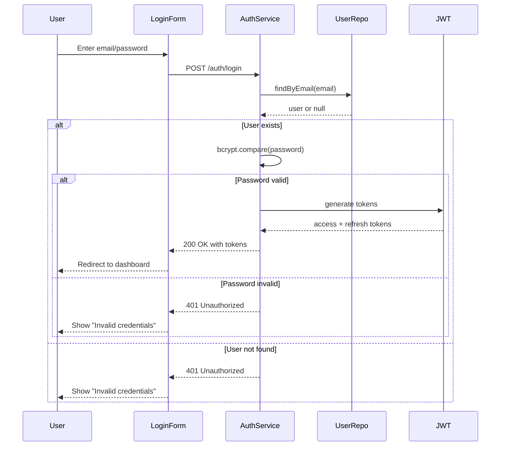

---

name: openspec-orchestrator
description: Orchestrates OpenSpec workflow using existing SRS, Use Cases, and SDD documents. Creates ONE spec per use case (UC-XX) as the atomic unit of implementation. Each spec maps directly to a sprint. Orders specs by use case dependencies (includes/extends).
compatibility: opencode
metadata:
  audience: developers
---
---

# OpenSpec Orchestrator Skill

## What I do

- Takes existing SRS, Use Cases, and SDD documents (from your other skills)
- Initializes OpenSpec structure in the project
- **Creates ONE spec per use case (UC-XX) = one implementable unit = one sprint**
- Orders specs by use case dependencies (include/extend relationships)
- Creates baseline specs in `openspec/specs/UC-XX-nombre/`
- Creates change proposals in `openspec/changes/` for the first use case
- Provides traceability back to original RF-XX, UC-XX, and components

## When to use me

Use this skill:

- AFTER `srs-specification`, `detailed-use-case`, and `software-design` have generated their outputs
- When you're ready to start incremental development with OpenSpec
- When you want to plan sprints by use case

Do NOT use this skill:

- Before generating SRS, Use Cases, and SDD
- When you just want the full documents (use your other skills)

## Prerequisites

The following documents MUST exist in `inputs/` directory:

| Document                                 | Skill source      | Required |
| ---------------------------------------- | ----------------- | -------- |
| `SRS_[Project]_v1.0.md`                | srs-specification | ✅ Yes   |
| `detailed_use_cases_[Project]_v1.0.md` | detailed-use-case | ✅ Yes   |
| `SDD_[Project]_v1.0.md`                | software-design   | ✅ Yes   |

If any are missing, ask the user: *"I need [document] to proceed. Please run the corresponding skill first."*

## Workflow

### Step 1 — Load existing documents

Read from `inputs/`:

1. **Use Cases document** — Extract:

   - Use case codes (UC-01, UC-02, UC-03...)
   - Use case names and titles
   - Primary flows (happy path steps)
   - Secondary flows (alternatives/exceptions)
   - **Include/extend relationships** between use cases
   - Preconditions and postconditions
   - Actors involved
2. **SRS document** — Extract:

   - RF-XX that map to each use case (from traceability)
   - Priority of each requirement (High/Medium/Low)
3. **SDD document** — Extract:

   - Components that implement each use case
   - Component dependencies
   - Sequence diagrams for each use case

### Step 2 — Initialize OpenSpec (if not exists)

```bash
openspec init
```

This creates:

```
openspec/
├── specs/
└── changes/
```

### Step 3 — Generate config.yaml

Create `openspec/config.yaml`:

```yaml
# openspec/config.yaml
schema: spec-driven

context: |
  Tech stack: [From SDD]
  API conventions: [From SDD]
  Testing strategy: [From SDD or SRS]

rules:
  proposal:
    - Include traceability to RF-XX and UC-XX
    - Identify dependencies on other use cases
  specs:
    - Each spec represents ONE use case (UC-XX)
    - Use ## Purpose and ## Requirements sections
    - Use SHALL for mandatory requirements
    - Each requirement MUST have at least one #### Scenario:
  design:
    - Include sequence diagrams for the use case flow
    - Reference components from SDD

project:
  name: [Project Name]
  version: 1.0.0
```

### Step 4 — Extract use cases and their dependencies

From the `detailed-use-case` document, extract:

| Use Case | Name                     | Dependencies (includes/extends) | RFs          | Priority |
| -------- | ------------------------ | ------------------------------- | ------------ | -------- |
| UC-01    | Login usuario            | None                            | RF-01, RF-02 | High     |
| UC-02    | Registrar gasto WhatsApp | UC-01 (requires login)          | RF-05        | High     |
| UC-03    | Ver dashboard            | UC-01 (requires login)          | RF-10        | High     |
| UC-04    | Exportar reportes        | UC-03 (depends on dashboard)    | RF-11        | Medium   |
| UC-05    | Recuperar contraseña    | None                            | RF-03        | Medium   |

### Step 5 — Order use cases by dependencies

Build dependency graph from include/extend relationships:

```
Level 0 (no dependencies):
UC-01 (Login)
UC-05 (Recuperar contraseña)

Level 1 (depends on Level 0):
UC-02 (Registrar gasto) → depends on UC-01
UC-03 (Ver dashboard) → depends on UC-01

Level 2 (depends on Level 1):
UC-04 (Exportar reportes) → depends on UC-03
```

**Ordered list for implementation:**

| Order | Use Case                    | Dependencies | Priority | Sprint              |
| ----- | --------------------------- | ------------ | -------- | ------------------- |
| 1     | UC-01 Login                 | None         | High     | Sprint 1            |
| 2     | UC-05 Recuperar contraseña | None         | Medium   | Sprint 1 (paralelo) |
| 3     | UC-03 Ver dashboard         | UC-01        | High     | Sprint 2            |
| 4     | UC-02 Registrar gasto       | UC-01        | High     | Sprint 2 (paralelo) |
| 5     | UC-04 Exportar reportes     | UC-03        | Medium   | Sprint 3            |

### Step 6 — Create baseline specs for EACH use case

**IMPORTANT:** Create ONE spec per use case. The spec name = use case code + name.

```bash
mkdir -p openspec/specs/UC-01-login-usuario
mkdir -p openspec/specs/UC-02-registrar-gasto-whatsapp
mkdir -p openspec/specs/UC-03-ver-dashboard
mkdir -p openspec/specs/UC-04-exportar-reportes
mkdir -p openspec/specs/UC-05-recuperar-contrasena
```

For each use case, create `openspec/specs/UC-XX-nombre/spec.md`:

```markdown
## Purpose
[Use case description from detailed-use-case document]

## Requirements

### Requirement: [RF-XX from SRS for this use case]
The system SHALL [description from SRS].

#### Scenario: [Primary flow - happy path]
- **WHEN** [trigger from use case primary flow step 1]
- **THEN** [expected outcome from use case postcondition]

#### Scenario: [Secondary flow - alternative]
- **WHEN** [trigger from secondary flow]
- **THEN** [expected outcome]

## Acceptance Criteria (from use case postconditions)
- [Postcondition 1 from use case]
- [Postcondition 2 from use case]

## Stories (child tasks for this use case)
- [ ] Story 1: [First user story from use case flow]
- [ ] Story 2: [Second user story from use case flow]
- [ ] Story 3: [Third user story from use case flow]

## Technical Notes (from SDD)
- Components: [Component names that implement this use case]
- Dependencies: [Other use cases this depends on]
- Sequence Diagram: (see design.md)

## Traceability
| Source | Reference |
| ------ | --------- |
| SRS | RF-01, RF-02 |
| Use Case | UC-01 |
| SDD | AuthService, LoginForm |
```

**Example for UC-01 Login:**

```markdown
## Purpose
Allow users to authenticate into the system with email and password.

## Requirements

### Requirement: User Authentication (RF-01)
The system SHALL authenticate users using email and password, issuing JWT tokens.

#### Scenario: Successful login
- **WHEN** user provides valid email and valid password
- **THEN** system returns access token and refresh token
- **AND** user is redirected to dashboard

#### Scenario: Invalid credentials
- **WHEN** user provides invalid email or password
- **THEN** system returns 401 Unauthorized
- **AND** system shows "Invalid email or password"

## Acceptance Criteria
- User can login with valid credentials
- User sees error message with invalid credentials
- User is redirected to dashboard after login

## Stories
- [ ] Story 1: Create login form component
- [ ] Story 2: Implement authentication API call
- [ ] Story 3: Add error handling for invalid credentials
- [ ] Story 4: Store JWT token securely
- [ ] Story 5: Redirect to dashboard on success

## Technical Notes
- Components: AuthService, LoginForm, UserRepository
- Dependencies: None (base use case)

## Traceability
| Source | Reference |
| ------ | --------- |
| SRS | RF-01, RF-02 |
| Use Case | UC-01 |
| SDD | AuthService section 5.1 |
```

**Example for UC-02 Register Expense (depends on UC-01):**

```markdown
## Purpose
Allow users to register expenses via WhatsApp messages.

## Requirements

### Requirement: Register Expense via WhatsApp (RF-05)
The system SHALL process WhatsApp messages to register expenses.

#### Scenario: Valid message format
- **WHEN** user sends "gasto 5000 taxi"
- **THEN** system registers expense of 5000 with description "taxi"
- **AND** system responds "✅ Gasto registrado: $5000 en taxi"

#### Scenario: Invalid message format
- **WHEN** user sends "5000 taxi" (without "gasto" keyword)
- **THEN** system responds "No entendí. Ejemplo: gasto 5000 taxi"

## Acceptance Criteria
- User can register expense with valid format
- User receives confirmation message
- User receives help message with invalid format

## Stories
- [ ] Story 1: Parse WhatsApp message format
- [ ] Story 2: Validate message structure
- [ ] Story 3: Save expense to database
- [ ] Story 4: Send confirmation response
- [ ] Story 5: Handle invalid format with help message

## Technical Notes
- Components: WhatsAppHandler, ExpenseService
- Dependencies: UC-01 (requires authenticated user)

## Traceability
| Source | Reference |
| ------ | --------- |
| SRS | RF-05 |
| Use Case | UC-02 |
| SDD | WhatsAppHandler section 5.3 |
```

### Step 7 — Create change proposal for first use case

Only for the FIRST use case in the ordered list (UC-01):

```bash
mkdir -p openspec/changes/UC-01-login-usuario
```

Generate the following files:

#### 7.1 Generate .openspec.yaml

```yaml
# openspec/changes/UC-01-login-usuario/.openspec.yaml
schema: spec-driven
change_id: UC-01-login-usuario
capability: UC-01-login-usuario
status: proposed
created_at: [ISO date]
specs:
  - ../specs/UC-01-login-usuario/spec.md
```

#### 7.2 Generate proposal.md

```markdown
# Change: UC-01 Login Usuario

## Why
Users need to authenticate to access protected features of the system.

## What Changes
- **ADDED** User authentication with email/password
- **ADDED** JWT token generation on successful login
- **ADDED** Login form UI component

## Impact
- New specs: `specs/UC-01-login-usuario/spec.md`
- Affected existing specs: None
- Dependencies on other capabilities: None (base use case)

## Traceability
| Requirement | Source |
| ----------- | ------ |
| RF-01, RF-02 | SRS section 3.2 |
| UC-01 | detailed_use_cases section UC-01 |
| AuthService | SDD section 5.1 |
```

#### 7.3 Generate design.md

```markdown
# Design: UC-01 Login Usuario

## Context
This is the base authentication use case. Other use cases depend on it.

## Goals / Non-Goals
- Goals: Implement secure email/password authentication
- Non-Goals: Social login, MFA (future sprints)

## Sequence Diagram



## Components

### LoginForm

**From SDD section:** 5.1
**Responsibility:** Capture user credentials, display errors
**Interface:** onSubmit(email, password) → Promise`<AuthResponse>`

### AuthService

**From SDD section:** 5.1
**Responsibility:** Validate credentials, issue tokens
**Interface:** login(email, password) → Promise`<TokenResponse>`

### UserRepository

**From SDD section:** 5.2
**Responsibility:** Find user by email
**Interface:** findByEmail(email) → Promise<User | null>

## Architecture Decisions

### ADR-001: JWT for authentication

**Decision:** Use JWT tokens for stateless authentication
**Rationale:** Scalable, no session storage needed
**Consequences:** Need token refresh mechanism

## Component Traceability

| RF-XX | Component              | Status   |
| ----- | ---------------------- | -------- |
| RF-01 | AuthService, LoginForm | Designed |
| RF-02 | JWT service            | Designed |

```

#### 7.4 Generate tasks.md

```markdown
# Tasks: UC-01 Login Usuario

## Prerequisites
- [ ] Baseline spec created in `specs/UC-01-login-usuario/spec.md`
- [ ] Change proposal created
- [ ] design.md reviewed and approved

## Implementation Tasks

### 1. Backend Components
- [ ] 1.1 Create UserRepository interface
  - Acceptance: findByEmail method defined
  - Verify: Type checking passes
  - Files: `src/repositories/UserRepository.ts`

- [ ] 1.2 Implement AuthService login method
  - Acceptance: Login validates credentials and returns tokens
  - Verify: Unit tests pass
  - Files: `src/services/AuthService.ts`

- [ ] 1.3 Create POST /auth/login endpoint
  - Acceptance: API accepts email/password, returns JWT
  - Verify: Integration tests pass
  - Files: `src/api/auth/login.ts`

### 2. Frontend Components
- [ ] 2.1 Create LoginForm component
  - Acceptance: Form with email, password fields and submit button
  - Verify: Storybook renders component
  - Files: `src/components/LoginForm.tsx`

- [ ] 2.2 Add error handling UI
  - Acceptance: Shows "Invalid credentials" message on error
  - Verify: Manual test with wrong password
  - Files: `src/components/LoginForm.tsx`

- [ ] 2.3 Implement redirect on success
  - Acceptance: Redirects to /dashboard after login
  - Verify: E2E test passes
  - Files: `src/pages/login.tsx`

### 3. Testing
- [ ] 3.1 Write unit tests for AuthService
  - Acceptance: Coverage >= 80%
  - Verify: `npm test -- --coverage`

- [ ] 3.2 Write E2E test for login flow
  - Acceptance: Login -> redirect -> dashboard visible
  - Verify: `npm run test:e2e`

## Validation Checklist
- [ ] All tasks completed
- [ ] All acceptance criteria from spec met
- [ ] All RFs satisfied (RF-01, RF-02)
- [ ] Tests passing

## Dependencies
- None (base use case)
```

### Step 8 — Present summary to user

```markdown
# OpenSpec Orchestration Complete

## Project: [Project Name]

### Use Cases → Specs Mapping

| Use Case | Spec Location | Dependencies | Sprint |
| -------- | ------------- | ------------ | ------ |
| UC-01 Login | `specs/UC-01-login-usuario/` | None | Sprint 1 |
| UC-05 Password Recovery | `specs/UC-05-recuperar-contrasena/` | None | Sprint 1 |
| UC-03 Dashboard | `specs/UC-03-ver-dashboard/` | UC-01 | Sprint 2 |
| UC-02 Register Expense | `specs/UC-02-registrar-gasto/` | UC-01 | Sprint 2 |
| UC-04 Export Reports | `specs/UC-04-exportar-reportes/` | UC-03 | Sprint 3 |

### Implementation Order (by Sprint)

**Sprint 1 (parallel - 2 specs):**
- ✅ UC-01 Login (change created)
- ⏳ UC-05 Password Recovery (create change after UC-01 done)

**Sprint 2 (parallel - depends on UC-01):**
- ⏳ UC-03 Dashboard
- ⏳ UC-02 Register Expense

**Sprint 3:**
- ⏳ UC-04 Export Reports

### OpenSpec Structure

```

openspec/
├── config.yaml
├── specs/
│   ├── UC-01-login-usuario/
│   │   └── spec.md
│   ├── UC-02-registrar-gasto-whatsapp/
│   │   └── spec.md
│   ├── UC-03-ver-dashboard/
│   │   └── spec.md
│   ├── UC-04-exportar-reportes/
│   │   └── spec.md
│   └── UC-05-recuperar-contrasena/
│       └── spec.md
└── changes/
    └── UC-01-login-usuario/
        ├── .openspec.yaml
        ├── proposal.md
        ├── design.md
        └── tasks.md

```

### Next Steps

```bash
# 1. Validate the change
openspec validate UC-01-login-usuario --strict

# 2. Review the change
openspec show UC-01-login-usuario

# 3. Apply (implement)
/opsx:apply UC-01-login-usuario

# 4. Archive when complete
openspec archive UC-01-login-usuario --yes

# 5. Create next change for UC-05 (parallel sprint)
openspec new change UC-05-recuperar-contrasena
```

### Commands to Create Remaining Changes

After archiving UC-01 and UC-05, create changes for Sprint 2:

```bash
openspec new change UC-03-ver-dashboard
openspec new change UC-02-registrar-gasto-whatsapp
```

## Output Structure Summary

| Location                           | Files                                                            |
| ---------------------------------- | ---------------------------------------------------------------- |
| `openspec/specs/UC-XX-nombre/`   | `spec.md` (one per use case)                                   |
| `openspec/changes/UC-XX-nombre/` | `.openspec.yaml`, `proposal.md`, `design.md`, `tasks.md` |
| `openspec/`                      | `config.yaml`                                                  |

## Validation Rules

- [ ] Each spec directory is named `UC-XX-nombre-del-caso-uso`
- [ ] Each spec has `## Purpose` and `## Requirements`
- [ ] Each requirement uses `SHALL` and has `#### Scenario:` with `- **WHEN**` and `- **THEN**`
- [ ] Each spec includes Stories and Technical Notes
- [ ] Each change has `.openspec.yaml`, `proposal.md`, `design.md`, `tasks.md`
- [ ] Use cases are ordered by dependencies (Level 0 first)
