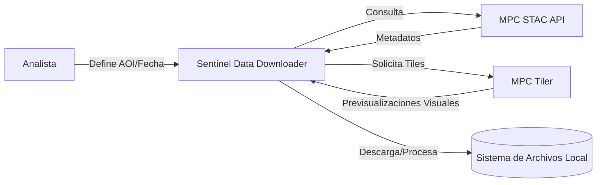
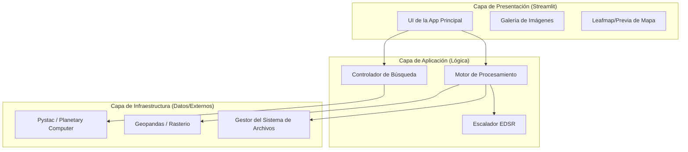
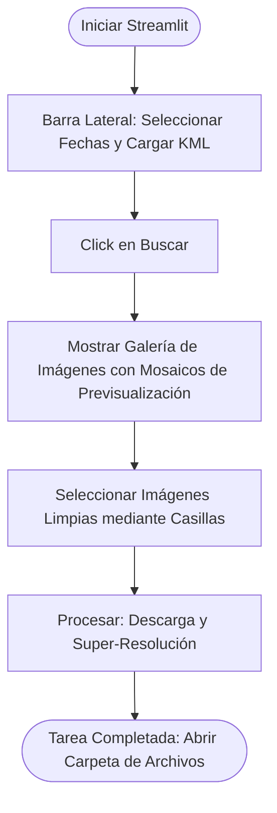

# Documento de Diseño de Software (SDD) - Sentinel Data Downloader

**Versión:** 1.0
**Fecha:** 22 de abril de 2026
**Basado en SRS:** `SRS_SentinelDataDownloader_v1.0.md`
**Basado en Casos de Uso:** `detailed_use_cases_Fase1_v1.0.md`, `detailed_use_cases_Fase2_v1.0.md`

| Rol                  | Nombre         | Aprobación |
| -------------------- | -------------- | ----------- |
| Arquitecto           | Antigravity AI | ☐          |
| Líder de Desarrollo | TBD            | ☐          |

---

## 1. INTRODUCCIÓN

### 1.1 Propósito

Este Documento de Diseño de Software (SDD) describe la arquitectura, los componentes y el diseño detallado de **Sentinel Data Downloader**. Sirve como la referencia técnica principal para la fase de implementación, cerrando la brecha entre los requerimientos y el código.

### 1.2 Alcance

El SDD cubre el diseño de:

- Integración de la API STAC para la búsqueda de imágenes.
- Renderizado dinámico de mosaicos (tiles) y enmascaramiento para previsualización.
- Procesamiento de datos locales (recorte, filtrado de nubes).
- Super-resolución basada en IA (EDSR).
- Gestión jerárquica del sistema de archivos.

**No** cubre análisis geoespacial avanzado (por ejemplo, clasificación de cobertura de suelo) ni la implementación de una plataforma SIG completa.

### 1.3 Descripción General

Este documento está organizado en:

- Descripción General del Sistema (Contexto del usuario).
- Arquitectura del Sistema (Patrones de alto nivel y ADRs).
- Diseño de Datos (Almacenamiento y estructuras).
- Diseño de Componentes (Algoritmos y lógica).
- Interfaz Humana (UI/UX).
- Matriz de Trazabilidad (Mapeo RF/UC).

### 1.4 Material de Referencia

| Referencia | Título                                       | Fuente                                                                                                                                                                             |
| ---------- | --------------------------------------------- | ---------------------------------------------------------------------------------------------------------------------------------------------------------------------------------- |
| SRS-01     | Especificación de Requerimientos de Software | [outputs/SRS_SentinelDataDownloader_v1.0.md](file:///Users/juanjosecoronelcrespo/Documents/dtic-projects/Fer-Testing/AISDLC-app/phase_one/outputs/SRS_SentinelDataDownloader_v1.0.md) |
| UC-F1      | Casos de Uso Detallados (Fase 1)              | [outputs/detailed_use_cases_Fase1_v1.0.md](file:///Users/juanjosecoronelcrespo/Documents/dtic-projects/Fer-Testing/AISDLC-app/phase_one/outputs/detailed_use_cases_Fase1_v1.0.md)     |
| UC-F2      | Casos de Uso Detallados (Fase 2)              | [outputs/detailed_use_cases_Fase2_v1.0.md](file:///Users/juanjosecoronelcrespo/Documents/dtic-projects/Fer-Testing/AISDLC-app/phase_one/outputs/detailed_use_cases_Fase2_v1.0.md)     |

### 1.5 Definiciones y Acrónimos

| Término | Definición                                                          |
| -------- | -------------------------------------------------------------------- |
| ADR      | Architecture Decision Record (Registro de Decisión de Arquitectura) |
| STAC     | SpatioTemporal Asset Catalog                                         |
| MPC      | Microsoft Planetary Computer                                         |
| SCL      | Scene Classification Layer (Capa de máscara de nubes)               |
| EDSR     | Enhanced Deep Residual Networks (Super-Resolución)                  |

---

## 2. DESCRIPCIÓN GENERAL DEL SISTEMA

**Sentinel Data Downloader** es una herramienta especializada para analistas que necesitan datos satelitales "limpios" (libres de nubes) y de alta resolución para modelos de detección de cambios o análisis en QGIS. Agiliza el descubrimiento y la preparación de imágenes Sentinel-2 L2A.

### 2.1 Diagrama de Contexto del Sistema



---

## 3. ARQUITECTURA DEL SISTEMA

### 3.1 Diseño Arquitectónico

El sistema sigue una **Arquitectura en Capas** para desacoplar la interfaz de usuario del procesamiento geoespacial pesado y las integraciones de APIs externas.



### 3.2 Descripción de la Descomposición

| Subsistema                     | Responsabilidad                                                | Interfaces Clave                      | Depende De       |
| ------------------------------ | -------------------------------------------------------------- | ------------------------------------- | ---------------- |
| Controlador de Búsqueda       | Orquestar consultas a la API STAC de MPC.                      | `search_images(rango_fechas, aoi)`  | Cliente MPC      |
| Motor de Procesamiento         | Manejar recortes, filtrado de nubes y generación de PNG.      | `process_bands(item_id, geometria)` | GeoHandler       |
| Escalador EDSR                 | Implementar super-resolución mediante modelos pre-entrenados. | `upscale(imagen, factor)`           | Runtime DL Local |
| Gestor del Sistema de Archivos | Gestionar la jerarquía de carpetas y limpieza.                | `save_to_path(año, mes, día)`     | Python OS/Shutil |

### 3.3 Justificación del Diseño (ADRs)

#### ADR-01: Stack Tecnológico

**Estado:** Aceptado
**Contexto:** El desarrollo rápido de herramientas geoespaciales requiere un fuerte soporte de librerías.
**Decisión:** Usar **Python 3.9+** y **Streamlit**.
**Consecuencias:** Alta productividad, integración nativa con `rasterio` y `geopandas`, pero el rendimiento está limitado por el modelo de actualización de Streamlit.

#### ADR-02: Patrón en Capas

**Estado:** Aceptado
**Decisión:** Desacoplar la lógica de Búsqueda del Procesamiento.
**Consecuencias:** Permite probar la funcionalidad de búsqueda sin descargar archivos TIFF de gran tamaño.

#### ADR-03: Estrategia de Almacenamiento Local

**Estado:** Aceptado
**Decisión:** Jerarquía estandarizada `Data_Sentinel/[Año]/[Mes]/[Día]`.
**Consecuencias:** Fácil indexación para herramientas externas como QGIS, pero requiere gestión manual del espacio en disco o limpieza automatizada (RF-07).

---

## 4. DISEÑO DE DATOS

### 4.1 Descripción de los Datos

El sistema interactúa con metadatos STAC transitorios y almacena archivos geoespaciales físicos (TIFF) e imágenes procesadas (PNG).

### 4.2 Diccionario de Datos

| Entidad/Campo      | Tipo       | Descripción                                              |
| ------------------ | ---------- | --------------------------------------------------------- |
| `eo:cloud_cover` | Float      | Porcentaje de nubes en el mosaico completo (desde STAC).  |
| `SCL`            | Raster     | Capa de Clasificación de Escena (valores 0-11).          |
| `Clean PNG`      | Binario    | Imagen RGB combinada sin nubes detectadas en el AOI.      |
| `AOI`            | Geometría | Polígono de KML/GeoJSON que define el área de interés. |

---

## 5. DISEÑO DE COMPONENTES

### 5.1 Componente: Controlador de Búsqueda

**Responsabilidad:** Filtrar el catálogo STAC por AOI y Fecha.
**Algoritmo:**

```
FUNCIÓN search_images(mes_inicio, año_inicio, mes_fin, año_fin, geom_aoi):
    rango = format_date_range(inicio, fin)
    resultados = pystac_client.search(
        collections=["sentinel-2-l2a"],
        intersects=geom_aoi,
        datetime=rango
    )
    RETORNAR resultados.item_collection()
```

### 5.2 Componente: Filtro de Nubes (Motor de Procesamiento)

**Responsabilidad:** Analizar la capa SCL y descartar recortes nublados.
**Algoritmo:**

```
FUNCIÓN filter_clouds(raster_scl):
    codigos_nubes = [1, 2, 3, 8, 9, 10] # Saturado, Sombra, Nube, etc.
    valores_pixeles = raster_scl.read(1)
    conteo_nubes = numpy.isin(valores_pixeles, codigos_nubes).sum()
    SI conteo_nubes / total_pixeles > 0.05 ENTONCES
        RETORNAR False (esta_nublado)
    SINO
        RETORNAR True (esta_limpio)
    FIN SI
```

---

## 6. DISEÑO DE INTERFAZ HUMANA

### 6.1 Descripción de la Interfaz de Usuario

El usuario navega a través de una barra lateral para las entradas y un tablero principal para los resultados.



### 6.2 Acciones de Pantalla

| Pantalla       | Objeto                   | Acción             | Comportamiento                                                  |
| -------------- | ------------------------ | ------------------- | --------------------------------------------------------------- |
| Barra Lateral  | Cargador de KML          | Seleccionar Archivo | Carga el AOI para la consulta y el enmascaramiento visual.      |
| Galería       | Casilla de Verificación | Alternar            | Agrega/Elimina el ID del ítem de la cola de descarga.          |
| Pie de página | Botón de Procesar       | Click               | Activa la secuencia: descarga -> recorte -> filtro -> escalado. |

---

## 7. MATRIZ DE REQUERIMIENTOS

| Requerimiento | Descripción                 | Componente(s)            | Caso(s) de Uso | Estado    |
| ------------- | ---------------------------- | ------------------------ | -------------- | --------- |
| RF-01         | Búsqueda por fecha/área    | Controlador de Búsqueda | UC-01          | Diseñado |
| RF-02         | Previsualización Dinámica  | UI Principal + Tiler     | UC-02          | Diseñado |
| RF-03         | Galería de Selección       | Gal + UI                 | UC-03          | Diseñado |
| RF-04         | Descarga Optimizada          | Motor de Procesamiento   | UC-04          | Diseñado |
| RF-05         | Filtro de Nubes              | Motor de Procesamiento   | UC-05          | Diseñado |
| RF-06         | Super-Resolución            | Escalador EDSR           | UC-06          | Diseñado |
| RF-07         | Jerarquía de Almacenamiento | Gestor FileSys           | UC-04, UC-05   | Diseñado |

---

## 8. APÉNDICES

### 8.1 Referencia de Códigos SCL

| Código | Clase                  | Acción en el SDD |
| ------- | ---------------------- | ----------------- |
| 1-3     | Saturado/Sombra        | Filtrar           |
| 4-7     | Vegetación/Agua/Suelo | Mantener          |
| 8-10    | Nube Media/Alta/Cirrus | Filtrar           |

### 8.2 Configuración de EDSR

- Entrada Base: 128x128px (Recortado de Sentinel B02, B03, B04).
- Modelo 1: Escalado x4.
- Modelo 2: Escalado x2.
- Salida Final: 1024x1024px, PNG de 8 bits.
