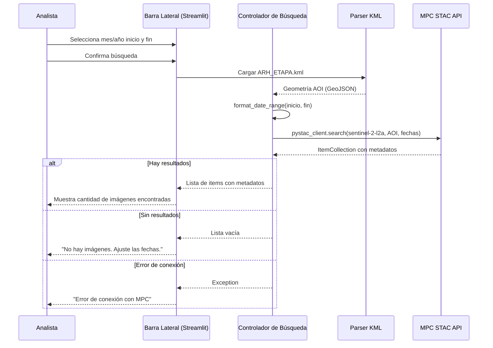

# Design: UC-01 Buscar Imágenes por Fecha y Área

## Context
Este es el caso de uso base del sistema. Todos los demás casos de uso dependen de que la búsqueda devuelva resultados válidos. Establece la conexión con Microsoft Planetary Computer y la carga del AOI.

## Goals / Non-Goals
- **Goals**: Implementar búsqueda temporal y espacial de imágenes Sentinel-2 L2A vía API STAC de MPC
- **Non-Goals**: Filtrado avanzado por tipo de cobertura de suelo, búsqueda por otras colecciones satelitales

## Sequence Diagram

## Components

### Barra Lateral (UI Input)

**From SDD section:** 6.1
**Responsibility:** Capturar fechas de inicio/fin y mostrar estado de búsqueda
**Interface:** Widgets Streamlit (`st.selectbox` para mes, `st.number_input` para año, `st.button` para buscar)

### Parser KML

**From SDD section:** 5.1 (parte del Controlador de Búsqueda)
**Responsibility:** Leer `ARH_ETAPA.kml` y extraer la geometría como objeto GeoJSON
**Interface:** `load_aoi(kml_path) → GeoJSON geometry`

### Controlador de Búsqueda

**From SDD section:** 5.1
**Responsibility:** Orquestar consultas a la API STAC de MPC
**Interface:** `search_images(mes_inicio, año_inicio, mes_fin, año_fin, geom_aoi) → ItemCollection`

## Architecture Decisions

### ADR-001: pystac-client para consultas STAC

**Decision:** Usar `pystac-client` como cliente STAC en lugar de requests HTTP directos
**Rationale:** Proporciona abstracciones de alto nivel para búsquedas con filtros temporales y espaciales. Es la librería estándar del ecosistema STAC.
**Consequences:** Dependencia de la librería `pystac-client` y su compatibilidad con la versión del API de MPC.

### ADR-002: KML como fuente del AOI

**Decision:** Usar `ARH_ETAPA.kml` como archivo fuente del área de interés
**Rationale:** El usuario ya dispone de este archivo como parte de su flujo de trabajo con QGIS.
**Consequences:** Necesidad de parsear KML a GeoJSON para la consulta STAC. Se requiere `geopandas` con soporte KML (`fiona`).

## Component Traceability

| RF-XX | Component | Status |
| ----- | --------- | ------ |
| RF-01 | Controlador de Búsqueda, Parser KML, Barra Lateral | Designed |
