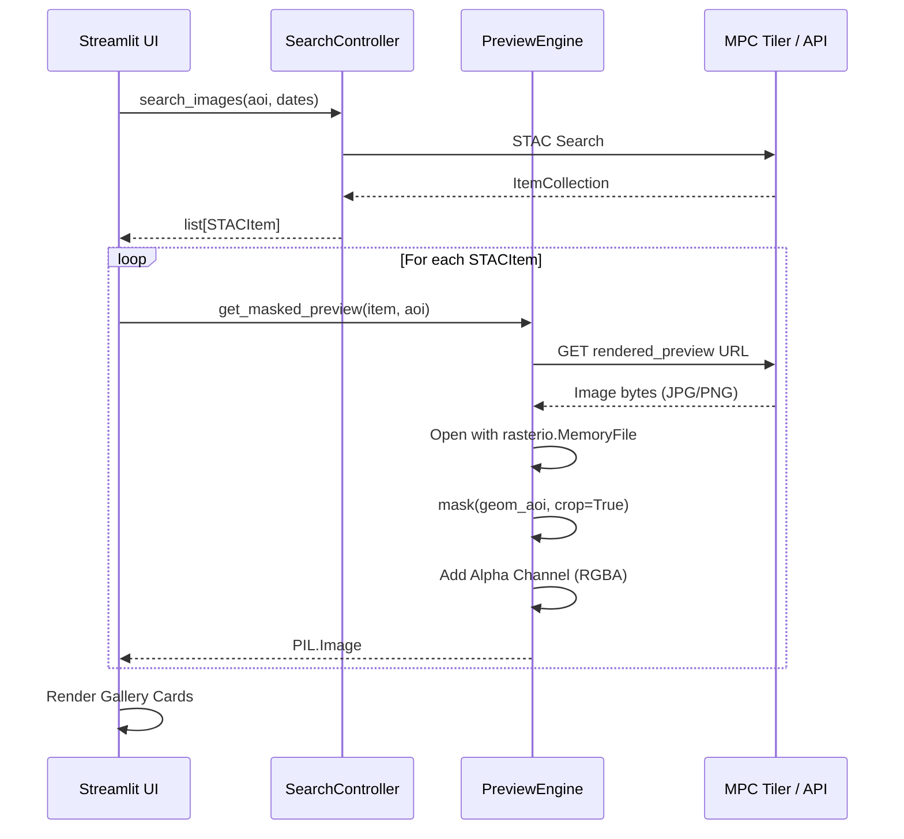

# Design: UC-02 Previsualizar imagen con máscara

## Sequence Diagram

## Component Architecture

### PreviewEngine (`src/preview_engine.py`)
- **Functions**:
  - `download_image(url)`: Descarga bytes.
  - `apply_aoi_mask(image_bytes, geom_aoi)`: Realiza el recorte geoespacial.
  - `get_masked_preview(...)`: Orquestador del componente.

### UI Enhancements (`app.py`)
- Uso de `st.columns` para crear una cuadrícula.
- Implementación de `st.cache_data` para los resultados del `PreviewEngine`.
- Integración de selectores (checkbox) en cada card.

## Performance Considerations
- El asset `rendered_preview` tiene un tamaño reducido (aprox. 256px o 512px).
- El procesamiento con `rasterio` sobre estas dimensiones es instantáneo (<100ms).
- Se utilizarán hilos o caché de Streamlit para asegurar que el scroll no se bloquee.
