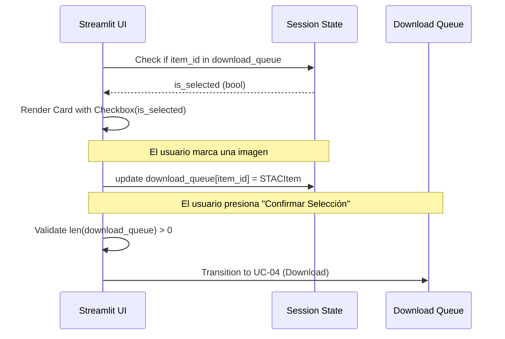

# Design: UC-03 Seleccionar imágenes de la galería

## Context
Actualmente, el sistema muestra una galería de imágenes con previsualizaciones recortadas (UC-02). Sin embargo, no existe un mecanismo formal para consolidar estas selecciones en una cola de trabajo que persista si el usuario realiza una nueva búsqueda o cambia de página.

## Goals / Non-Goals

**Goals:**
- Implementar una "Cola de Selección" persistente.
- Permitir la acumulación de imágenes de diferentes búsquedas (distintas fechas/áreas).
- Proporcionar feedback visual claro sobre qué imágenes están en la cola.
- Validar la selección antes de habilitar el flujo de descarga (UC-04).

**Non-Goals:**
- Implementar la lógica de descarga real (corresponde a UC-04).
- Persistencia en base de datos (se usará memoria de sesión).

## Decisions

### 1. Gestión de Estado con Session State
Se utilizará un diccionario en `st.session_state["download_queue"]` mapeando `item_id` -> `STACItem`.
- **Rationale**: Almacenar el objeto completo evita tener que volver a consultar el API de MPC para obtener los enlaces de los assets en pasos posteriores. El uso de un diccionario facilita la búsqueda y eliminación de items individuales en O(1).

### 2. Layout de Galería y Feedback
Cada card de la galería consultará el `session_state` para determinar su estado inicial.
- **Rationale**: Esto asegura que si el usuario vuelve a ver una imagen ya seleccionada en una búsqueda posterior, el checkbox aparezca marcado.

### 3. Botón de Consolidación
Se añadirá una sección de "Resumen de Selección" al final de la galería o en la barra lateral.
- **Rationale**: Centraliza el control de avance del flujo de trabajo.

## Risks / Trade-offs

- **[Riesgo] Consumo de memoria** → **[Mitigación]** Los objetos `STACItem` son ligeros (JSON). No se almacenarán las imágenes procesadas en la cola, solo los metadatos y referencias.
- **[Riesgo] Items de diferentes AOIs** → **[Mitigación]** El sistema permitirá mezclar items siempre que pertenezcan a la misma colección (Sentinel-2 L2A), pero se mostrará una advertencia si las geometrías son muy distantes.

## Sequence Diagram

