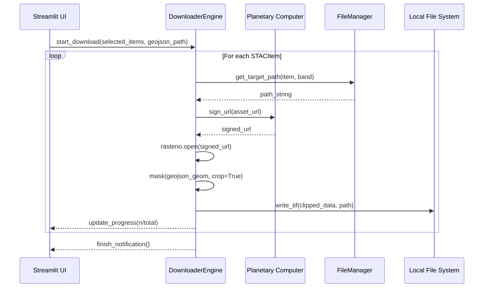

# Design: UC-04 Descargar bandas y recorte

## Context
Tras la selección (UC-03), el sistema dispone de una lista de `STACItem` con URLs de activos (B02, B03, B04, SCL, Visual). Estas URLs requieren firma para ser accesibles. Además, el área de estudio general suele ser más grande que la cuadrícula operativa del proyecto, por lo que se requiere un recorte espacial (clip) para reducir el tamaño de los archivos y estandarizar la zona de trabajo.

## Goals / Non-Goals

**Goals:**
- Automatizar la firma y descarga de múltiples bandas.
- Realizar el recorte geoespacial exacto usando `Cuadrícula_ARH.geojson`.
- Organizar los archivos en una estructura jerárquica clara.
- Proporcionar feedback visual de progreso.

**Non-Goals:**
- Procesamiento multiespectral avanzado (NDVI, etc.) - corresponde a UC-05.
- Subida a nube (S3/Azure Blob) - se guardará localmente.

## Decisions

### 1. Motor de Descarga y Recorte
Se utilizará `rasterio` para leer las URLs firmadas directamente como flujos (si es posible) o descargar y luego procesar. Dado que queremos aplicar un recorte, la mejor estrategia es:
1.  Firmar la URL del activo.
2.  Abrir el dataset remoto con `rasterio` (soporta lectura vía HTTP si se configura correctamente).
3.  Aplicar `rasterio.mask.mask` con la geometría del GeoJSON.
4.  Escribir el resultado recortado en un archivo local.
- **Rationale**: Evita descargar la imagen completa de 100km x 100km si el AOI es pequeño, ahorrando ancho de banda y tiempo.

### 2. Estructura de Directorios
Se implementará un `FileManager` que determine la ruta absoluta basada en la fecha del `STACItem`:
`Data_Sentinel/[YYYY]/[MM]/[DD]/[Item_ID]_[Band].tif`
- **Rationale**: Facilita la navegación manual y el descubrimiento por parte de scripts posteriores.

### 3. Manejo de Errores
Cada banda se tratará como una tarea independiente. Si una banda falla, se registrará el error y se continuará con la siguiente.
- **Rationale**: Las imágenes Sentinel-2 a veces tienen assets corruptos o fallos temporales de red; no debemos detener la descarga de todo el lote por un solo archivo.

## Risks / Trade-offs

- **[Riesgo] Expiración de firmas** → **[Mitigación]** Firmar cada URL justo antes de iniciar su descarga/lectura.
- **[Riesgo] Consumo de disco** → **[Mitigación]** El recorte (clip) reduce significativamente el tamaño del archivo final comparado con el tile original.

## Sequence Diagram

