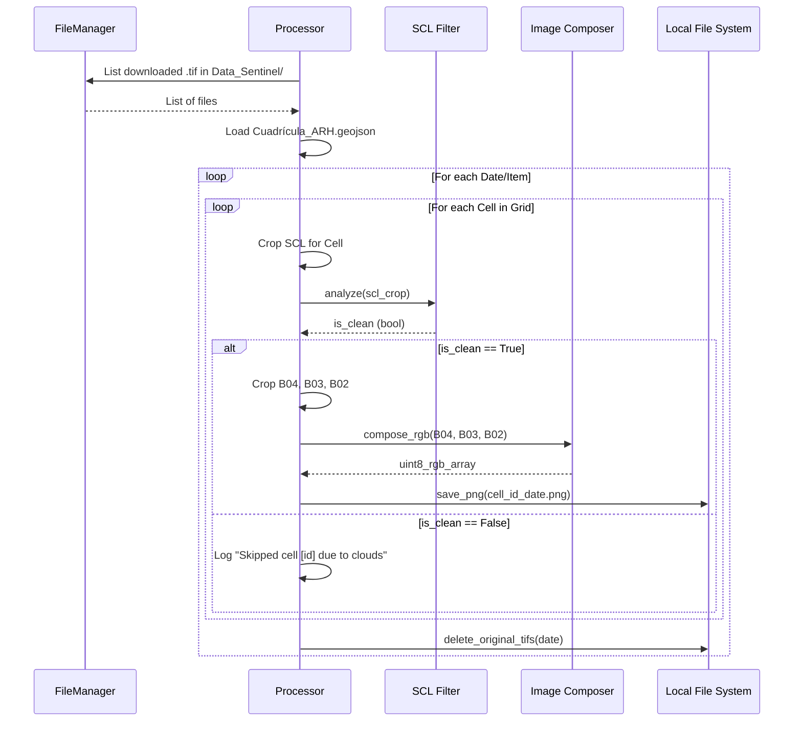

# Design: UC-05 Procesar recortes y filtrar nubes

## Context
Tras la descarga (UC-04), tenemos archivos GeoTIFF recortados al área general de interés. Sin embargo, para alimentar modelos de IA, necesitamos fragmentar estas imágenes en celdas de la cuadrícula operativa (`Cuadrícula_ARH.geojson`) y descartar aquellas que contengan nubes o sombras, garantizando la pureza del dataset.

## Goals / Non-Goals

**Goals:**
- Fragmentar imágenes Sentinel-2 en celdas basadas en un GeoJSON.
- Filtrar nubes automáticamente usando la banda SCL con un umbral del 5%.
- Generar archivos PNG RGB (8-bit) estandarizados.
- Automatizar la limpieza de archivos temporales .tif.

**Non-Goals:**
- Entrenamiento de modelos de IA.
- Super-resolución (corresponde a UC-06).

## Decisions

### 1. Iteración sobre Cuadrícula
Se utilizará `geopandas` para cargar `Cuadrícula_ARH.geojson`. El sistema iterará sobre cada fila (Feature) del GeoDataFrame.
- **Rationale**: Permite asociar metadatos del GeoJSON (como IDs de parcela) directamente al nombre del archivo de salida.

### 2. Algoritmo de Filtrado SCL
Para cada celda de la cuadrícula, se extraerá el recorte de la banda SCL.
- **Códigos de descarte**: 1 (Saturado), 2 (Sombra oscura), 3 (Sombra nube), 8 (Nube media), 9 (Nube alta), 10 (Cirrus).
- **Umbral**: Si `(count(pixels_descarte) / count(pixels_totales)) > 0.05`, se descarta.
- **Rationale**: El umbral del 5% permite tolerar pequeñas impurezas en los bordes sin comprometer la calidad general del dataset.

### 3. Normalización y Composición RGB
Sentinel-2 se descarga en 16 bits (uint16). Para PNG, se requiere conversión a 8 bits (uint8).
- **Estrategia**: Aplicar un escalado lineal (min-max) o un umbral fijo (ej: 0-3000) para evitar que píxeles muy brillantes (nubes residuales) oscurezcan el resto de la imagen.
- **Rationale**: Garantiza que las imágenes tengan un contraste visual consistente para los modelos de IA.

### 4. Estrategia de Pruebas
Se utilizará el entorno local de Python (`python3`) para ejecutar `pytest`.
- **Rationale**: Cumplimiento con la restricción del usuario de evitar `conda` para las pruebas de este módulo.

## Risks / Trade-offs

- **[Riesgo] Carga computacional** → **[Mitigación]** Procesar cada fecha de forma secuencial y usar `MemoryFile` de `rasterio` para pasos intermedios.
- **[Riesgo] Inconsistencia de color** → **[Mitigación]** Usar un factor de escala constante (ej. 1/10000) o normalización por percentiles.

## Sequence Diagram

