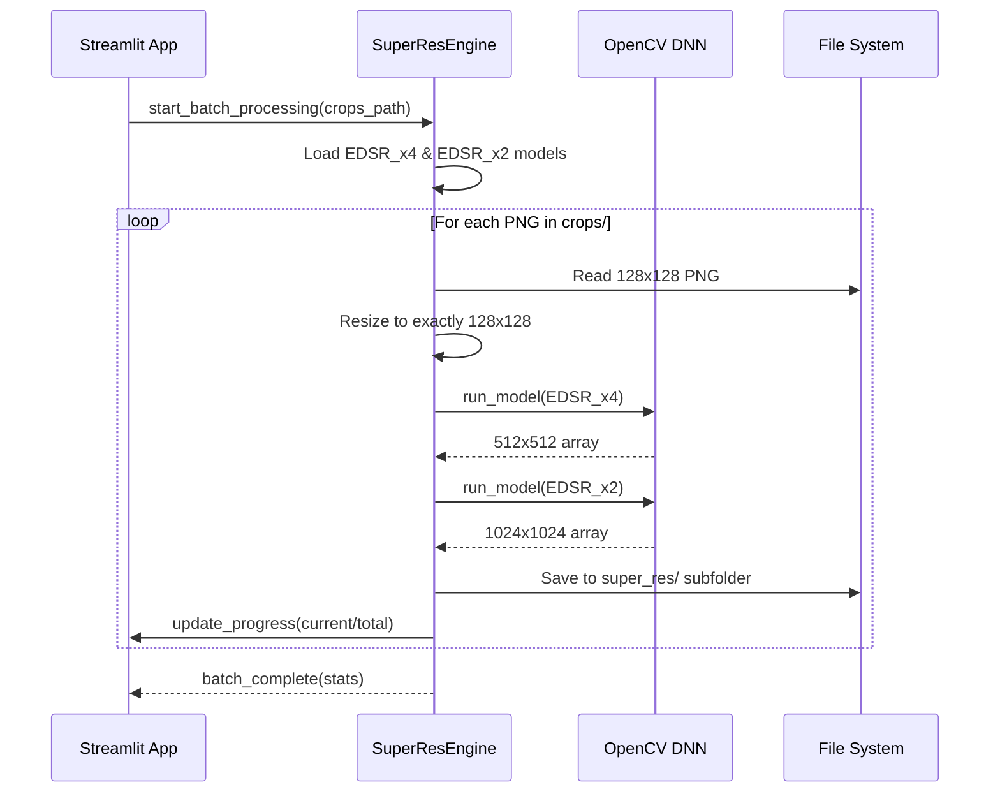

# Design: UC-06 Escalar imágenes con EDSR

## Context
Tras generar los recortes PNG (UC-05), el dataset está limpio pero limitado a la resolución nativa de 10m/px. Para aplicaciones que requieren mayor detalle visual, implementaremos un motor de Super-Resolución basado en redes residuales (EDSR).

## Goals / Non-Goals

**Goals:**
- Incrementar la resolución de recortes de ~128x128 a exactamente 1024x1024 (8x total).
- Implementar un pipeline de inferencia AI desacoplado de la UI.
- Soportar procesamiento por lotes (batch processing).

**Non-Goals:**
- Re-entrenamiento de modelos (se usarán pesos pre-entrenados).
- Procesamiento en tiempo real (es un proceso batch).

## Decisions

### 1. Motor de Inferencia: OpenCV dnn_superres
Se utilizará el módulo `dnn_superres` de OpenCV para la ejecución de los modelos.
- **Rationale**: Es significativamente más ligero que cargar frameworks completos como PyTorch o TensorFlow para tareas de inferencia de un solo modelo. Soporta archivos de pesos `.pb` estándar.

### 2. Pipeline de Escalado 8x (Secuencial)
Para alcanzar el objetivo de 1024x1024 partiendo de 128x128, se aplicarán dos modelos en cadena:
1. **Paso 1**: Redimensionado base a 128x128 (si el recorte no fuera exacto).
2. **Paso 2**: Inferencia EDSR x4 -> Resultado 512x512.
3. **Paso 3**: Inferencia EDSR x2 -> Resultado 1024x1024.
- **Rationale**: El escalado secuencial permite mantener una mayor fidelidad en los detalles finos comparado con un escalado directo de gran factor.

### 3. Almacenamiento de Pesos
Los modelos se almacenarán en la carpeta `sentinel-project/models/`.
- **Archivos**: `EDSR_x4.pb` y `EDSR_x2.pb`.
- **Rationale**: Facilita la portabilidad del proyecto sin dependencias de descarga externa en tiempo de ejecución.

### 4. Estructura de Salida
Los resultados se guardarán en: `Data_Sentinel/[Año]/[Mes]/[Día]/super_res/[id]_[fecha]_SR.png`.

## Sequence Diagram

## Infrastructure Requirements
- **Librerías**: `opencv-contrib-python` (incluye dnn_superres).
- **Modelos**: Requiere la presencia de los archivos `.pb` en la carpeta `models/`.
