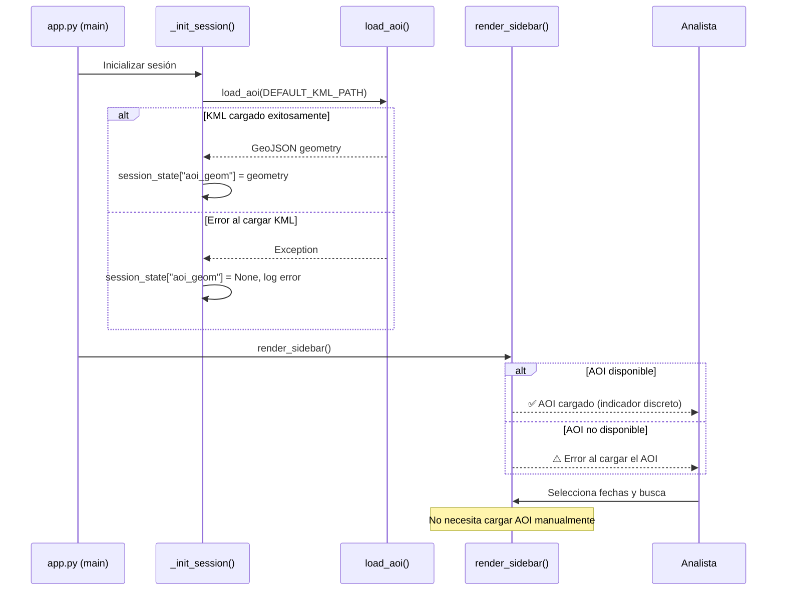

## Context

La barra lateral actualmente contiene una sección "📍 Área de Estudio" con:
1. Un `st.text_input` para la ruta del KML (valor por defecto: `DEFAULT_KML_PATH`)
2. Un `st.button("📂 Cargar AOI")` que invoca `_load_aoi_cached()`
3. Mensajes de estado (`st.error` / `st.success`) según el resultado

El archivo KML es fijo (`external/ARH_ETAPA.kml`) y nunca cambia entre sesiones. El flujo actual obliga al usuario a pulsar un botón cada vez que inicia la aplicación, lo cual es innecesario.

## Goals / Non-Goals

**Goals:**
- Cargar el AOI automáticamente al iniciar la sesión, sin intervención del usuario
- Eliminar los widgets de carga KML de la barra lateral
- Mantener un indicador discreto del estado del AOI en la barra lateral
- Manejar errores de carga del KML mostrando un mensaje claro sin bloquear la UI

**Non-Goals:**
- Cambiar la fuente del AOI (sigue siendo el mismo archivo KML)
- Modificar `src/geo_utils.py` (la función `load_aoi()` no cambia)
- Permitir al usuario seleccionar un archivo KML diferente desde la UI
- Modificar el comportamiento de búsqueda o descarga

## Sequence Diagram

## Components

### _init_session() — app.py

**Cambio:** Agregar la carga automática del AOI al inicializar la sesión. Si `aoi_geom` no está en session_state, llamar a `_load_aoi_cached(DEFAULT_KML_PATH)`.

### render_sidebar() — app.py

**Cambio:** Eliminar la sección completa "📍 Área de Estudio" (text_input, button, mensajes). Reemplazar con un indicador de estado del AOI simple (un `st.caption` o `st.success` breve).

### _run_search() — app.py

**Cambio:** Simplificar para que ya no reciba `kml_path` en el dict de parámetros. El AOI siempre estará disponible en session_state porque se cargó en `_init_session()`. Si por alguna razón no está, usar `DEFAULT_KML_PATH` como fallback.

### render_sidebar return value — app.py

**Cambio:** Eliminar la clave `kml_path` del diccionario de retorno de `render_sidebar()`.

## Decisions

### Decisión 1: Carga en _init_session vs. en render_sidebar

**Decision:** Cargar el AOI en `_init_session()`, no en `render_sidebar()`
**Rationale:** `_init_session()` se ejecuta una sola vez por sesión. Cargar ahí garantiza que el AOI está disponible antes de renderizar cualquier componente, y evita recargas innecesarias en cada re-render de Streamlit.
**Consequences:** Si el archivo KML no existe al inicio, el error se registra una vez y el usuario ve el mensaje inmediatamente.

### Decisión 2: Mantener indicador de estado vs. eliminar todo

**Decision:** Mantener un indicador discreto del estado del AOI en la barra lateral
**Rationale:** El usuario necesita saber que el AOI está cargado correctamente. Un `st.caption` con el tipo de geometría es suficiente. Si hay error, un `st.error` visible ayuda a diagnosticar problemas.

## Risks / Trade-offs

- **[KML movido o eliminado]** → Si el archivo KML no está en la ruta esperada, la aplicación mostrará un error al inicio. **Mitigación:** Mensaje de error claro indicando la ruta esperada.
- **[Flexibilidad reducida]** → Ya no se podrá cambiar el KML desde la UI. **Mitigación:** Esto es intencional — el KML es fijo para este proyecto. Si en el futuro se necesita, se puede re-agregar.

## Component Traceability

| RF-XX | Component | Status |
| ----- | --------- | ------ |
| RF-01 | _init_session, render_sidebar (carga automática AOI) | Designed |
