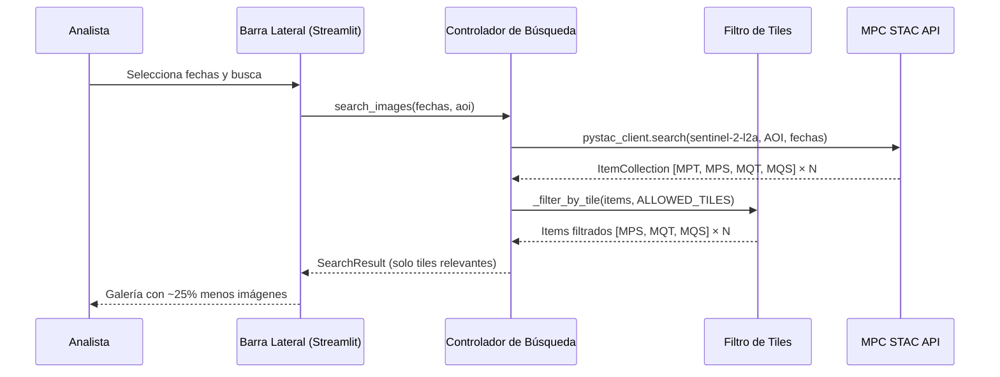

## Context

Actualmente, el Controlador de Búsqueda (`search_controller.py`) ejecuta una consulta STAC contra la colección `sentinel-2-l2a` de MPC usando el AOI del archivo KML. La API devuelve **todos** los tiles de Sentinel-2 cuya huella (footprint) intersecta con el AOI. Para la zona de estudio de ETAPA, esto produce 4 tiles por cada pasada del satélite: **MPT**, **MPS**, **MQT** y **MQS**.

El tile **MPT** cubre una porción marginal que no aporta datos útiles para la zona de estudio. Procesar este tile innecesariamente multiplica por ~1.33x el volumen de datos en toda la cadena posterior (previsualización, selección, descarga, recorte, super-resolución).

El flujo actual es:

```
API STAC → [MPT, MPS, MQT, MQS] × N pasadas → Galería → Descarga → Procesamiento
```

El flujo deseado es:

```
API STAC → [MPT, MPS, MQT, MQS] × N pasadas → FILTRO → [MPS, MQT, MQS] × N pasadas → Galería → …
```

## Goals / Non-Goals

**Goals:**
- Filtrar los resultados STAC para excluir el tile MPT después de recibir la respuesta de la API
- Hacer el filtro configurable mediante una constante `ALLOWED_TILES` en `search_controller.py`
- Mantener la interfaz pública de `search_images()` sin cambios (transparente para la UI)
- Actualizar los tests unitarios para verificar el filtrado

**Non-Goals:**
- Modificar los parámetros de la consulta STAC (la API no soporta filtrar por tile ID directamente)
- Cambiar la interfaz de usuario o añadir controles para seleccionar tiles manualmente
- Modificar el flujo de descarga o procesamiento posterior — estos ya funcionan con cualquier subconjunto de items

## Sequence Diagram



## Components

### Controlador de Búsqueda (search_controller.py)

**From SDD section:** 5.1
**Responsibility:** Orquestar consultas STAC y ahora también filtrar tiles no deseados post-consulta
**Cambios:**
1. Nueva constante `ALLOWED_TILES = ["MPS", "MQT", "MQS"]`
2. Nueva función `_extract_tile_id(item_id: str) -> str | None` — extrae el tile ID (e.g., `17MPS`) del `item_id` STAC
3. Nueva función `_filter_by_tile(items: list[STACItem], allowed: list[str]) -> list[STACItem]` — filtra items cuyo tile ID no esté en la lista permitida
4. Modificación de `search_images()` — invocar `_filter_by_tile()` después de parsear los items

### Estrategia de extracción del Tile ID

Los item IDs de Sentinel-2 siguen el formato:
```
S2B_MSIL2A_20250115T151619_R125_T17MPS_20250115T190440
                                      ^^^^^
                                      Tile ID (campo T seguido del código MGRS)
```

La extracción se hará buscando el segmento que comienza con `T` seguido de 5 caracteres alfanuméricos (código MGRS). Se compararán los últimos 3 caracteres del código MGRS contra `ALLOWED_TILES`.

## Decisions

### Decisión 1: Filtrado post-consulta vs. modificación de query STAC

**Decision:** Filtrar después de recibir los resultados de la API
**Alternativa considerada:** Usar `query` parameters en la búsqueda STAC para filtrar por `s2:mgrs_tile`
**Rationale:** La API STAC de MPC soporta filtros CQL2, pero filtrar post-consulta es más simple, no depende de features específicas de la API, y el volumen de datos de metadatos (no de imágenes) es pequeño. El overhead de recibir ~25% más de metadatos es negligible.
**Consequences:** Se descargan metadatos del tile MPT pero se descartan inmediatamente. Si en el futuro el volumen de búsquedas crece significativamente, se podría migrar a filtrado server-side.

### Decisión 2: Granularidad del filtro — sufijo de 3 caracteres

**Decision:** Comparar los últimos 3 caracteres del código MGRS (e.g., `MPS`, `MQT`) en lugar del código completo de 5 caracteres (e.g., `17MPS`)
**Rationale:** Los 2 primeros dígitos del código MGRS son la zona UTM (e.g., `17`) que es fija para esta zona de estudio. Usar solo los 3 caracteres de sufijo simplifica la configuración y es suficiente para el caso de uso actual.
**Consequences:** Si la zona de estudio se moviera a otra zona UTM donde los mismos sufijos tuvieran otro significado, habría que ajustar a código MGRS completo.

### Decisión 3: Constante configurable vs. parámetro de función

**Decision:** Usar una constante de módulo `ALLOWED_TILES` en `search_controller.py`
**Alternativa considerada:** Añadir un parámetro `allowed_tiles` a `search_images()`
**Rationale:** Los tiles permitidos son una configuración de dominio de la zona de estudio, no un parámetro de búsqueda que el usuario deba controlar. Una constante mantiene la interfaz limpia y permite cambiar la configuración sin modificar la firma de la función.

## Risks / Trade-offs

- **[Zona de estudio diferente]** → Si el proyecto se usa con otro AOI, los tiles permitidos serán diferentes. **Mitigación:** La constante `ALLOWED_TILES` es fácil de modificar. Se puede migrar a archivo de configuración en el futuro.
- **[Cambio de naming en Sentinel-2]** → Si ESA cambia el formato de los item IDs, el parser de tile ID fallaría. **Mitigación:** El parser usa regex robusto y loguea warnings en caso de no poder extraer el tile ID (no descarta items que no pueda parsear).
- **[Falso negativo]** → Si un item relevante tuviera un tile ID no incluido en `ALLOWED_TILES`, se perdería. **Mitigación:** Se loguean los items filtrados con nivel INFO para auditoría.

## Component Traceability

| RF-XX | Component | Status |
| ----- | --------- | ------ |
| RF-01 | Controlador de Búsqueda (filtro de tiles) | Designed |
