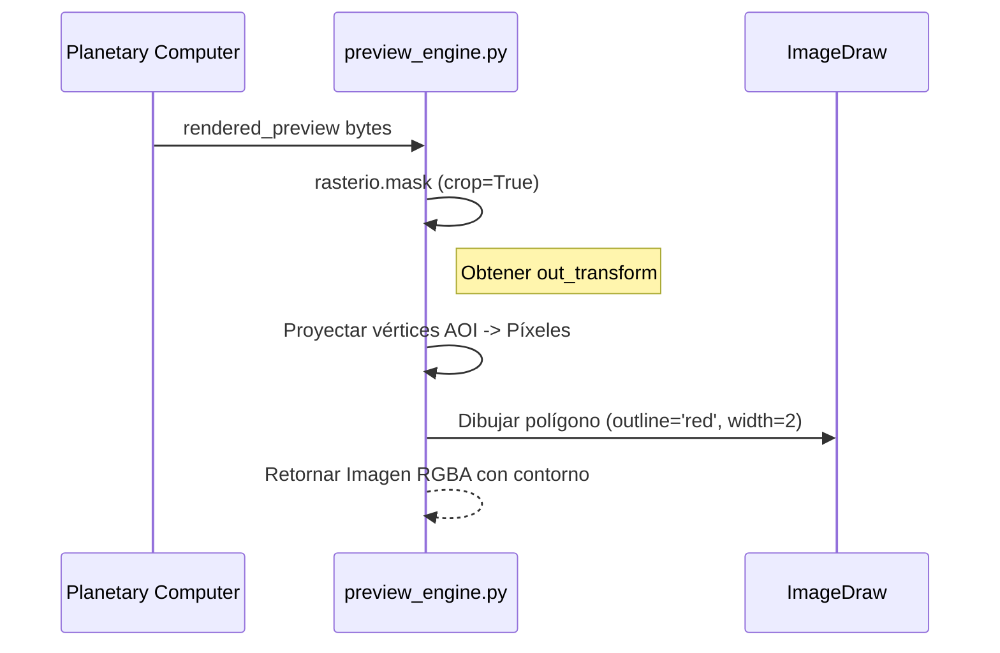

## Context

El motor de previsualización actual utiliza `rasterio.mask.mask` con `crop=True` para recortar la imagen `rendered_preview` de MPC. Esta función devuelve `out_image` y `out_transform`. La `out_transform` es clave porque mapea coordenadas del mundo a píxeles en la imagen de salida. Actualmente, solo usamos la imagen resultante, pero para dibujar el contorno necesitamos proyectar los vértices del AOI en el espacio de píxeles de esa imagen recortada.

## Goals / Non-Goals

**Goals:**
- Dibujar el contorno del AOI en color rojo (#FF0000) sobre la imagen de previsualización.
- Usar un grosor de línea de 2 píxeles para asegurar visibilidad.
- Mantener la transparencia del fondo (RGBA).

**Non-Goals:**
- Rellenar el AOI con color (solo contorno).
- Cambiar la lógica de recorte (se sigue usando el AOI como máscara).
- Agregar nuevas dependencias pesadas.

## Sequence Diagram

## Components

### src/preview_engine.py

**Cambio:** Actualizar `apply_aoi_mask` para:
1. Extraer los anillos del polígono (coordenadas lon/lat).
2. Usar `~out_transform` (inversa) de rasterio para convertir coordenadas lon/lat a (fila, columna) de la imagen de salida.
3. Usar `PIL.ImageDraw.Draw(img).polygon(...)` para dibujar el contorno.

### app.py

**Cambio:** No se requieren cambios estructurales, pero al cambiar la lógica de renderizado, el caché de Streamlit (`@st.cache_data`) debería invalidarse automáticamente si se reinicia la app o se cambian parámetros.

## Decisions

### Decisión 1: Librería de dibujo (PIL vs CV2)

**Decision:** Usar `PIL.ImageDraw`.
**Rationale:** La imagen ya está en formato `PIL.Image.Image` al final de `apply_aoi_mask`. `ImageDraw` es ligero y suficiente para dibujar polígonos con grosor de línea controlado.
**Consequences:** Evita conversiones adicionales a arrays de numpy para OpenCV.

### Decisión 2: Proyección de coordenadas

**Decision:** Usar la inversa de `out_transform` devuelta por `mask()`.
**Rationale:** `out_transform` mapea (fila, col) -> (x, y). Su inversa `~out_transform` mapea (x, y) -> (fila, col). Esto nos da los píxeles exactos dentro del recorte.

## Risks / Trade-offs

- **[Precisión de la Transformación]** -> Si la imagen original no tiene metadatos de CRS correctos, la proyección podría estar ligeramente desplazada. **Mitigación:** La mayoría de las previas de MPC tienen metadatos consistentes con el AOI.
- **[Polígonos Complejos]** -> AOIs con muchos vértices o agujeros. **Mitigación:** Dibujar cada anillo del polígono por separado.
