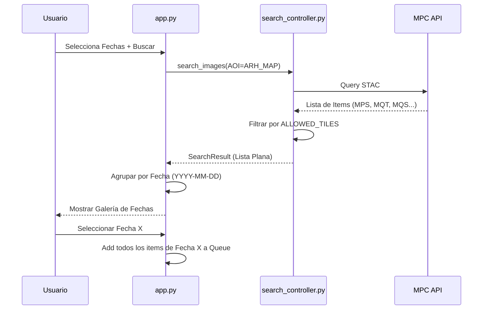

## Context

La aplicación Sentinel Data Downloader actualmente utiliza `ARH_ETAPA.kml` como su área de interés (AOI) por defecto y permite la selección individual de "tiles" de Sentinel-2. El proyecto ha evolucionado y ahora requiere el uso de `ARH_MAP.kml`, el cual abarca un área que intersecta siempre tres tiles específicos (`MPS`, `MQT`, `MQS`). Para mejorar la experiencia de usuario y garantizar la integridad de los datos procesados por los modelos de IA, se debe automatizar la descarga de estos tres tiles por cada fecha de interés.

## Goals / Non-Goals

**Goals:**
- Actualizar la referencia espacial a `ARH_MAP.kml`.
- Agrupar los resultados de búsqueda por fecha en la interfaz de usuario.
- Implementar la selección por "Fecha" que active la descarga de todos sus tiles asociados.
- Evitar colisiones de nombres de archivo al guardar múltiples tiles para la misma fecha en el mismo directorio.

**Non-Goals:**
- No se cambiará la lógica de recorte (clip) por cuadrícula, la cual seguirá usando `Cuadrícula_ARH.geojson`.
- No se modificará el proceso de Super-Resolución o Procesamiento de Cuadrícula (UC-05, UC-06).

## Decisions

### 1. Agrupamiento por Fecha en el Controlador
Se añadirá lógica en `SearchController` (o un helper en `app.py`) para organizar la lista plana de `STACItem` en un diccionario indexado por fecha (`YYYY-MM-DD`).
- **Rationale**: Facilita la renderización de la galería y la lógica de selección masiva.

### 2. Rediseño del `download_queue`
El estado de sesión `download_queue` cambiará su estructura de `dict[item_id, STACItem]` a `dict[date_str, list[STACItem]]`.
- **Rationale**: La unidad de trabajo ahora es la fecha. Esto simplifica el resumen de descarga y el proceso de ejecución.

### 3. Inclusión del Tile ID en el Nombre de Archivo
Se modificará `src/file_manager.py` para incluir un identificador del tile en el nombre del archivo resultante.
- **Formato propuesto**: `YYYYMMDD_[TILE]_BXX.tif` (ej: `20250101_MPS_B02.tif`).
- **Rationale**: Es crítico para evitar que los tiles de la misma fecha se sobrescriban entre sí al guardarse en la misma carpeta jerárquica.

### 4. Interfaz de Usuario (Streamlit)
- La galería mostrará una sola "card" por fecha.
- La previsualización de la fecha se generará a partir del primer tile disponible (ya que cubren áreas contiguas del mismo AOI).
- El porcentaje de nubes mostrado será el **promedio** de los tiles de ese día.

## Risks / Trade-offs

- **[Riesgo] Mayor Consumo de Almacenamiento** → Al descargar siempre 3 tiles por fecha, el espacio en disco se consumirá más rápido. *Mitigación*: Se informará al usuario en la UI sobre el tamaño estimado o la cantidad de archivos.
- **[Riesgo] Tiempos de Descarga** → La descarga de 3 tiles toma más tiempo que uno solo. *Mitigación*: Se optimizará el uso de `ThreadPoolExecutor` para la descarga de bandas y se mostrará un progreso detallado.
- **[Riesgo] Cobertura Incompleta** → Si uno de los 3 tiles no está disponible en MPC para una fecha específica. *Mitigación*: El sistema descargará lo que encuentre y notificará si la cobertura de la fecha es parcial.

## Sequence Diagram (Búsqueda y Selección)

