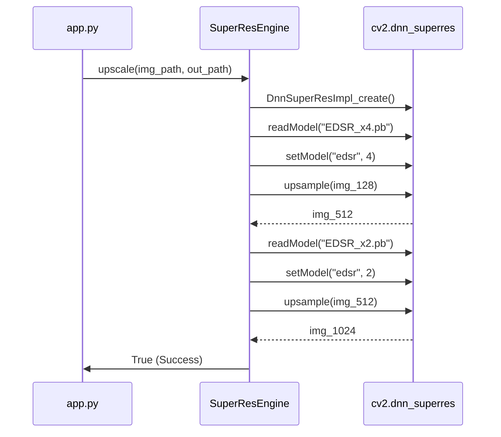

## Context

The project currently has a `SuperResEngine` in `src/super_resolution.py` that uses two separate `DnnSuperResImpl` instances for x4 and x2 upscaling. However, users report library errors (AttributeErrors) and incorrect resolution increases. The provided working code uses a single instance and reloads the model for each step, which might be more compatible with certain OpenCV versions or internal state management.

## Goals / Non-Goals

**Goals:**
- Implement a stable two-step upscaling pipeline (128 -> 512 -> 1024) using EDSR.
- Resolve `AttributeError` by ensuring correct module usage and potentially verifying dependencies.
- Match the execution pattern of the user's working script.

**Non-Goals:**
- Replacing the EDSR models with other architectures (e.g., FSRCNN, ESPCN).
- Parallelizing the super-resolution process beyond what's already implemented in the batch processor (unless necessary for stability).

## Decisions

### 1. Unified Model Loader vs Separate Instances
**Decision:** Use a single `DnnSuperResImpl` instance (or re-initialize) for each step if needed, or refine the separate instances approach to ensure they are correctly initialized.
**Rationale:** The user's working code re-reads models sequentially into an instance. This avoids potential memory or state conflicts between two parallel instances of the DNN engine if the underlying library has global state issues.

### 2. Dimension Validation
**Decision:** Add explicit dimension checks before and after each upsampling step.
**Rationale:** To prevent "resolución inesperada" errors reported by the user, ensuring the final output is exactly 1024x1024.

## Sequence Diagram

## Risks / Trade-offs

- **[Risk]** Memory usage spikes during dual-model loading → **[Mitigation]** Clear/Reset the DNN instance between steps if necessary.
- **[Risk]** `opencv-contrib-python` not actually installed in the environment → **[Mitigation]** Add a check at startup to verify `cv2.dnn_superres` exists.
