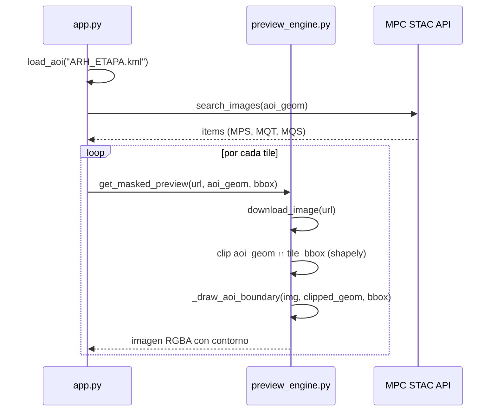

## Context

La galería de previsualización (UC-02, componente `preview_engine.py`) dibuja el contorno rojo del AOI sobre cada tile Sentinel-2. Actualmente:

1. **`app.py`** carga la geometría del AOI desde `external/ARH_MAP.kml` — un cuadrilátero simplificado de 5 vértices que NO representa la zona de estudio real (cuenca MACHANGARA, ~150 vértices en `ARH_ETAPA.kml`).
2. **`_draw_aoi_boundary()`** en `preview_engine.py` proyecta **todos** los vértices del AOI al espacio de píxeles del tile sin verificar si caen dentro del bounding box. Cuando la geometría excede los límites del tile, se dibujan líneas fuera de rango que generan artefactos visuales (triángulos).

El sistema de referencia (versión anterior del usuario) resuelve esto con `matplotlib.imshow(extent=...) + gdf.plot()`, que maneja la transformación y clipping automáticamente. Sin embargo, esta dependencia no es necesaria ya que `shapely` (ya disponible como dependencia de `geopandas`) ofrece clipping geométrico directo.

## Goals / Non-Goals

**Goals:**
- Mostrar el contorno rojo del AOI **real** (cuenca MACHANGARA) sobre los tiles de previsualización.
- El contorno SHALL dibujarse correctamente en los **tres tiles** (MPS, MQT, MQS), mostrando solo la porción del AOI que intersecta cada tile.
- Cerrar visualmente el polígono (conectar el último punto con el primero).

**Non-Goals:**
- Cambiar la lógica de búsqueda STAC (ya funciona correctamente con el GeoJSON del AOI).
- Modificar el proceso de descarga y recorte (UC-04) que ya usa la geometría correctamente via `rasterio.clip`.
- Migrar a matplotlib para la visualización (se mantiene PIL + shapely para mantener la arquitectura liviana del `preview_engine`).

## Decisions

### D1: Usar `ARH_ETAPA.kml` como fuente del AOI

**Decisión**: Cambiar `DEFAULT_KML_PATH` de `ARH_MAP.kml` a `ARH_ETAPA.kml`.

**Alternativas consideradas**:
- **(A) Combinar ambos KML**: Innecesario. `ARH_MAP.kml` es un bounding box simplificado que no aporta información útil.
- **(B) Permitir selección dinámica vía UI**: Sobredimensionado para el bug actual. Se puede implementar en un cambio futuro.

**Rationale**: `ARH_ETAPA.kml` contiene el polígono real exportado desde el SIG del proyecto, con ~150 vértices que representan fielmente los límites de la cuenca MACHANGARA.

### D2: Clipping geométrico con Shapely antes de dibujar

**Decisión**: Usar `shapely.geometry.shape(aoi_geom).intersection(box(*bbox))` para recortar la geometría del AOI al extent del tile antes de convertir a coordenadas de píxel.

**Alternativas consideradas**:
- **(A) matplotlib `imshow` + `gdf.plot()`**: Funciona (es lo que usa el sistema de referencia), pero introduce una dependencia pesada (`matplotlib`) en el preview engine solo para dibujar líneas.
- **(B) Clamp manual de coordenadas de píxel**: Recortar los valores `px`/`py` a `[0, width]`/`[0, height]` — no resuelve correctamente los bordes (las líneas se distorsionan).

**Rationale**: Shapely ya está instalada como dependencia transitiva de `geopandas`. El clipping geométrico produce la geometría correcta (polígonos parciales que siguen exactamente el borde del tile) sin añadir dependencias.

### D3: Manejar geometrías resultantes del clip

**Decisión**: Después del `intersection()`, la geometría resultante puede ser `Polygon`, `MultiPolygon`, `LineString`, `MultiLineString`, o `GeometryCollection`. La función `_draw_aoi_boundary` SHALL iterar sobre todos los componentes dibujables, extrayendo coordenadas de cada uno.

**Rationale**: Cuando el AOI cruza el borde de un tile, el resultado puede fragmentarse. Es necesario manejar todos los tipos posibles.

## Risks / Trade-offs

- **[Rendimiento con polígono complejo]** → ~150 vértices es trivial para shapely (~microsegundos). No se espera impacto en la latencia de renderizado. Mitigación: ya se usa `@st.cache_data` para cachear los resultados.
- **[Geometría vacía tras clip]** → Si un tile no intersecta el AOI, `intersection()` retorna un `EMPTY` geometry. Mitigación: verificar `geom.is_empty` antes de dibujar.
- **[Coordenadas 3D en KML]** → `ARH_ETAPA.kml` incluye coordenadas `lon,lat,0`. Mitigación: ya se usa `pt[:2]` para extraer solo `(lon, lat)`.
