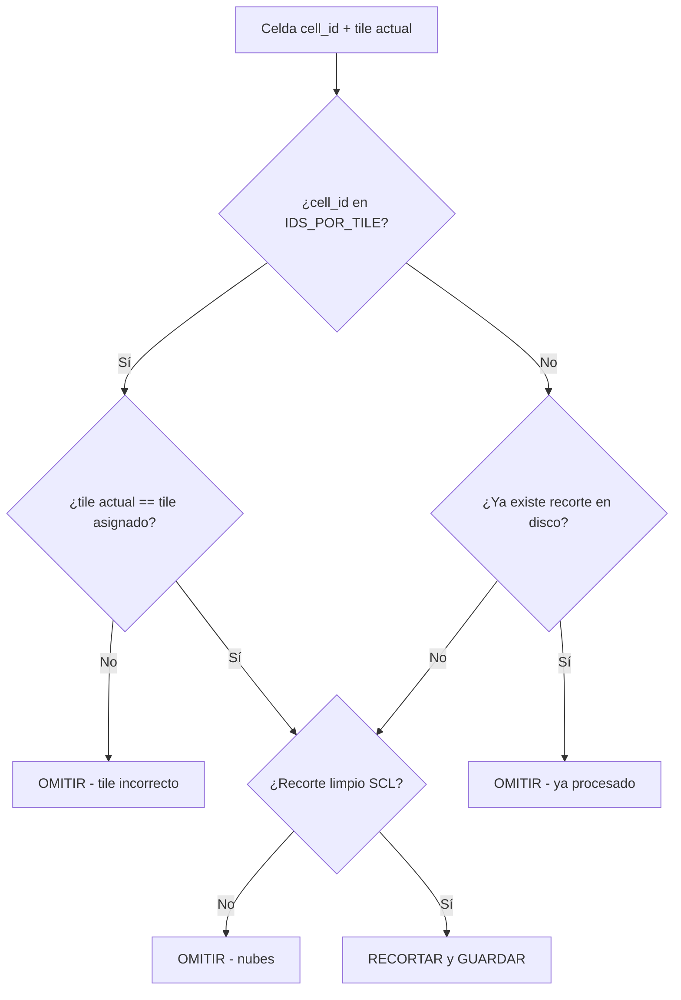

## Context

El motor de procesamiento (`processor.py`) itera cada tile descargado (MPS, MQT, MQS) sobre **todas** las celdas de la cuadrícula (`cuadricula_arh.geojson`). Dado que los tres tiles se superponen parcialmente, las celdas ubicadas en las zonas de solapamiento se recortan múltiples veces, generando archivos PNG duplicados con sufijo de tile diferente (e.g., `657_20250101_MPS.png` y `657_20250101_MQT.png`). Estos duplicados causan:

1. **Almacenamiento innecesario** en la carpeta `crops/`.
2. **Redimensionamiento redundante** (operación LANCZOS costosa por cada duplicado).
3. **Datos duplicados para IA**, lo que puede sesgar el entrenamiento de los modelos.

El flujo actual en `process_all_grids` es:

```
Para cada tile_id en tiles_data:
    Para cada celda en cuadrícula:
        → Validar tamaño (≥63px)
        → Validar SCL (≤5% nubes)
        → Guardar PNG
```

No existe ninguna verificación de duplicados ni asignación preferente de tile.

## Goals / Non-Goals

**Goals:**
- Eliminar recortes duplicados cuando una celda aparece en más de un tile.
- Asignar un tile fijo para las celdas de borde (definidas en `IDS_POR_TILE`) para garantizar la mejor cobertura.
- Para celdas no listadas, verificar existencia en disco antes de procesar.
- Mantener la lógica de filtrado SCL/nubes y la generación del mosaico RGB sin cambios.
- Reducir el tiempo de procesamiento y el uso de disco.

**Non-Goals:**
- No se modifica la estructura de directorios (`crops/`, `Data_Sentinel/...`).
- No se cambia la interfaz de `process_all_grids` (firma/retorno).
- No se comparan calidades entre tiles para elegir el mejor — se usa la asignación fija.
- No se modifica la lógica del mosaico RGB (`Color_YYYY-MM-DD.tif`).

## Decisions

### Decisión 1: Diccionario estático `IDS_POR_TILE` como constante de módulo

**Elección**: Definir `IDS_POR_TILE` como un `dict[str, list[str]]` a nivel de módulo en `processor.py`.

**Alternativas consideradas**:
- *Archivo externo (JSON/YAML)*: Añade complejidad de I/O y una dependencia de configuración. El mapeo es estable y pequeño.
- *Cálculo dinámico basado en geometría*: Más robusto para cambios de cuadrícula, pero mucho más complejo y lento. No justificado dado que la cuadrícula es fija.

**Razón**: Es la solución más simple y directa. El mapeo no cambiará a menos que cambie la cuadrícula del proyecto, y puede editarse fácilmente.

### Decisión 2: Verificación de existencia en disco para IDs no listados

**Elección**: Usar `list(crops_dir.glob(f"{cell_id}_*"))` para verificar si ya existe un recorte previo del mismo `cell_id` y fecha.

**Alternativas consideradas**:
- *Set en memoria*: Más rápido, pero no detecta recortes de ejecuciones anteriores.
- *Combinación Set + glob*: Ideal en teoría, pero el glob es suficientemente rápido para cientos de archivos.

**Razón**: El glob detecta tanto los recortes de la ejecución actual como los de ejecuciones previas. La carpeta `crops/` contiene típicamente cientos de archivos, por lo que la operación es instantánea.

### Decisión 3: Función auxiliar `should_process_cell` para encapsular la lógica

**Elección**: Crear una función `should_process_cell(cell_id, tile_id, crops_dir, date_str)` que centralice las tres validaciones:
1. ¿Está el ID en `IDS_POR_TILE`? → Solo procesar si el tile coincide.
2. ¿No está en la lista? → Verificar si ya existe en disco.
3. Si pasa ambas → proceder con validación SCL.

**Razón**: Separa la lógica de deduplicación de la lógica de procesamiento de celdas, facilitando testing y mantenimiento.

### Flujo de decisión revisado



## Risks / Trade-offs

- **[Riesgo] IDs de borde desactualizados** → Mitigación: El diccionario `IDS_POR_TILE` es fácilmente editable. Si la cuadrícula cambia, se actualiza el diccionario.
- **[Riesgo] Rendimiento de glob en directorios muy grandes** → Mitigación: La carpeta `crops/` típicamente tiene ~1000 archivos. Si crece significativamente, se puede migrar a un Set en memoria pre-cargado al inicio.
- **[Trade-off] Asignación fija vs. dinámica** → Se eligió la simplicidad de la asignación fija, sacrificando la adaptabilidad automática a cambios en la cuadrícula. Esto es aceptable para el caso de uso actual.
